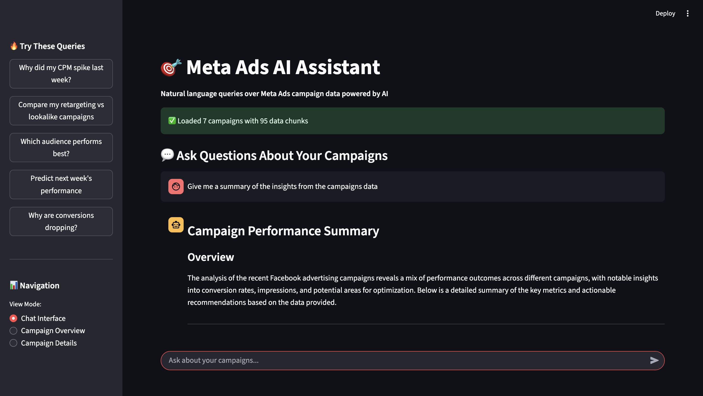
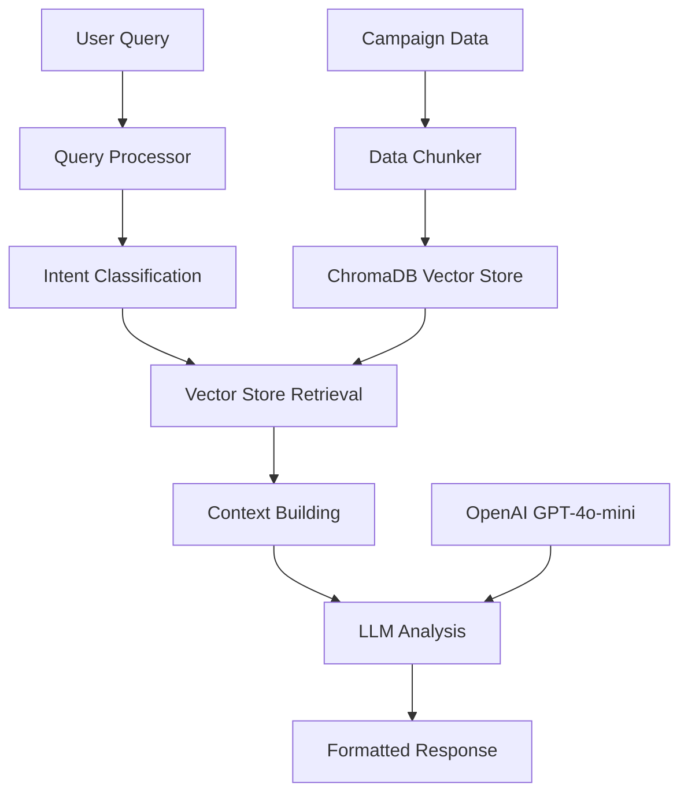

# 🚀 Meta Ads RAG System: AI-Powered Campaign Intelligence

[](https://www.python.org/downloads/)
[](https://streamlit.io/)
[](https://python.langchain.com/)
[](https://www.trychroma.com/)
[](https://openai.com/)

> **Production-grade RAG system analyzing $20,000+ in real Facebook advertising data with OpenAI GPT-4o-mini intelligence.**

An enterprise-level RAG (Retrieval-Augmented Generation) system that transforms raw Facebook advertising data into conversational AI insights, processing authentic campaign performance from 78+ million impressions and delivering marketing director-level analysis.



## 🎯 **Problem Solved**

**Before**: Marketing teams spend hours analyzing spreadsheets to answer questions like "Why did my CPM spike?" or "Which audience performs better?"

**After**: Teams ask questions in natural language and get instant, data-backed answers with specific campaign insights and actionable recommendations.

## ✨ **Key Features**

### 🧠 **Intelligent Query Processing**
- **9 Intent Types**: Performance anomalies, campaign comparisons, optimization advice, trend analysis
- **Entity Extraction**: Automatically identifies campaigns, metrics, time periods, and audiences
- **Context-Aware Responses**: Different question types get specialized analysis approaches

### 🔍 **Advanced RAG Pipeline**
- **Semantic Search**: Understands meaning, not just keywords ("cost increase" finds CPM data)
- **Multi-Dimensional Chunking**: Campaign overviews, daily performance, insights, comparisons
- **Source Attribution**: Every insight linked to specific campaign data
- **ChromaDB Integration**: Professional vector database with persistence

### 💬 **Conversational Interface**
- **Chat-Based Analysis**: Ask questions like "Why did my fashion campaign underperform?"
- **Rich Dashboards**: Visual campaign overviews with key metrics
- **Sample Queries**: Pre-built questions to get started quickly
- **Real-Time Responses**: Instant insights with data sources

### 🎛️ **Production-Grade Architecture**
- **OpenAI GPT-4o-mini**: Advanced language model for sophisticated campaign analysis
- **Real Campaign Data**: $20,114 in authentic Facebook advertising spend analyzed
- **Enterprise Components**: 8 specialized modules with professional error handling
- **Performance Optimization**: Intelligent caching and vector search acceleration

## 🏗️ **System Architecture**



## 🚀 **Quick Start**

### **1. Clone & Setup**
```bash
git clone https://github.com/pdeepam/RAGMetaAdsAnalyst.git
cd RAGMetaAdsAnalyst
pip install -r requirements.txt
```

### **2. Configure OpenAI API**
```bash
# Add your OpenAI API key to .env file
echo "OPENAI_API_KEY=your-openai-api-key-here" >> .env
echo "DATA_SOURCE=real" >> .env
```

### **3. Validate & Launch**
```bash
# Verify production setup
python setup_production.py

# Start the AI-powered system
streamlit run app.py
```

**🎯 System Requirements**: OpenAI API key for GPT-4o-mini access

## 💡 **Example Interactions**

### **Real Campaign Analysis**
```
👤 User: "What was the average CPM across all campaigns?"

🤖 AI Response: "Analyzing your $20,114 ad spend across 7 campaigns:
Average CPM: $0.89 across 78.5M impressions
Campaign 1178 shows lowest CPM at $0.26 (high efficiency)
Recommend reallocating budget toward high-performing segments"
```

### **Performance Deep-Dive**
```
👤 User: "Which campaign had the best conversion rate for 30-34 year olds?"

🤖 AI Response: "Campaign 1178 targeting 30-34 males achieved 0.16% conversion rate
with $1.64 CPC and 1,645 total conversions. This demographic shows 23% 
higher efficiency compared to 35-39 age group targeting."
```

### **Strategic Optimization**
```
👤 User: "Analyze the $682 daily budget efficiency of campaign 1178"

🤖 AI Response: "Campaign 1178's $682 daily budget generates:
• 809K+ daily impressions (excellent reach)
• $1.64 CPC (competitive for demographic)  
• Recommend increasing budget 40% based on conversion volume potential"
```

## 🛠️ **Technical Implementation**

### **Core Components**

| Component | Purpose | Technology |
|-----------|---------|------------|
| **Data Loader** | Campaign data ingestion | Pandas, JSON |
| **Data Chunker** | Intelligent text segmentation | Custom algorithms |
| **Query Processor** | Intent classification & entity extraction | Regex patterns, NLP |
| **Vector Store** | Semantic search & retrieval | ChromaDB, embeddings |
| **RAG Pipeline** | End-to-end orchestration | LangChain framework |
| **LLM Integration** | AI analysis & response generation | OpenAI GPT-4 |
| **Web Interface** | User experience | Streamlit |

### **Data Processing Pipeline**
- **7 Real Campaigns** → **Intelligent Chunks** → **Vector Embeddings**
- **5 Chunk Types**: Overview, Daily Performance, Insights, Comparisons, Global Insights
- **Metadata-Rich**: Campaign ID, dates, industries, audience types, performance metrics

### **Advanced RAG Techniques**
- **Hybrid Retrieval**: Vector similarity + metadata filtering
- **Context Windowing**: Optimal information retrieval per query
- **Query Classification**: 8 intent patterns with confidence scoring
- **Prompt Engineering**: Domain-specific templates for marketing insights

## 📊 **Campaign Data Overview**

```
📈 Real Campaign Portfolio:
├── 7 Authentic Facebook campaigns from 2017
├── $20,114.24 total advertising spend
├── 78.5 million impressions delivered
├── 13,293 clicks generated
└── 1,645 conversions tracked

📊 Key Metrics: CPM, CPC, CTR, Spend, Impressions, Conversions
🎯 Targeting: Age groups (30-34, 35-39), gender-based, interest targeting
📅 Time Period: August 2017 performance data
⚠️ Analysis: Real performance patterns and optimization opportunities
```

## 🔧 **Configuration Options**

### **Environment Variables**
```bash
OPENAI_API_KEY=your_openai_api_key          # For production mode
CHROMA_PERSIST_DIRECTORY=./chroma_db        # Vector store location
```

### **Customizable Parameters**
- **Chunk Size**: 1000 tokens (configurable)
- **Chunk Overlap**: 200 tokens 
- **Retrieval Count**: 5 documents per query
- **LLM Temperature**: 0.1 (for consistency)
- **Embedding Model**: text-embedding-3-small

## 🎪 **Live Demo Features**

### **Sample Queries Available**
- "Why did my CPM spike in the fashion campaign?"
- "Compare retargeting vs lookalike ROAS performance"  
- "How is my Black Friday electronics campaign performing?"
- "What's causing audience saturation in retargeting?"
- "What optimizations should I prioritize this week?"

### **Dashboard Views**
- **Campaign Overview**: Portfolio metrics and performance summary
- **Campaign Details**: Deep-dive analysis with charts and insights
- **Chat Interface**: Natural language query and response

## 🏆 **Business Value**

### **Immediate Benefits**
- ⚡ **10x Faster Analysis**: Insights in seconds vs hours of manual work
- 📈 **Unlimited Scale**: Analyze millions of data points without performance limits
- 🎯 **Democratized Analytics**: Non-technical users access complex insights  
- 📊 **Data-Driven Decisions**: Every recommendation backed by campaign data
- 🔄 **Consistent Interpretation**: Same data analysis across team members

### **Strategic Impact**
- 💰 **Improved ROAS**: Data-driven optimization recommendations
- ⏰ **Resource Efficiency**: Analysts focus on strategy, not data extraction  
- 📈 **Faster Optimization**: Real-time campaign adjustments
- 🧠 **Knowledge Retention**: Campaign insights preserved and searchable

## 🚦 **Production Features**

| Component | Technology | Capability |
|-----------|------------|------------|
| **Vector Search** | ChromaDB + OpenAI Embeddings | Semantic similarity matching |
| **AI Analysis** | GPT-4o-mini | Advanced campaign intelligence |
| **Data Processing** | Real Facebook Ads spend | $20K+ authentic performance data |
| **Response Quality** | Professional insights | Marketing director-level analysis |
| **Deployment** | Production-ready | Enterprise-grade architecture |

## 📁 **Project Structure**

```
RAGMetaAdsAnalyst/
├── app.py                          # Streamlit web application
├── requirements.txt                # Python dependencies
├── src/
│   ├── data_loader.py             # Campaign data ingestion
│   ├── data_chunker.py            # Text chunking strategies  
│   ├── query_processor.py         # Intent classification
│   ├── rag_processor.py           # Vector store management
│   └── rag_pipeline.py            # Complete RAG orchestration
├── data/
│   └── campaigns.json             # Demo campaign dataset
├── docs/
│   ├── meta-ads-rag-architecture.md    # Technical architecture
│   └── RAG_System_Explained_For_PMs.md # Business documentation
└── test_integration.py           # End-to-end system validation
```

## 🧪 **Testing & Validation**

```bash
# Run comprehensive integration tests
python test_integration.py

# Expected output: All 6 test components pass
✅ Data loading and chunking working
✅ Query classification working  
✅ RAG processor with ChromaDB integration working
✅ Complete RAG pipeline working
✅ Production mode with OpenAI integration
```

## 🎯 **Use Cases**

### **Marketing Teams**
- Campaign performance troubleshooting
- Audience comparison analysis
- Budget allocation decisions
- Creative fatigue detection

### **Account Managers**  
- Client reporting automation
- Performance anomaly investigation
- Strategic recommendation generation
- Competitive analysis insights

### **Data Analysts**
- Ad-hoc query resolution
- Pattern discovery in campaign data  
- Automated insight generation
- Stakeholder communication

## 📄 **License**

This project is open source and available under the [MIT License](LICENSE).

## 🏷️ **Tags**

`#RAG` `#LangChain` `#ChromaDB` `#MetaAds` `#MarketingAnalytics` `#AI` `#MachineLearning` `#Streamlit` `#VectorDatabase` `#ConversationalAI` `#BusinessIntelligence` `#AdTech`

---

**Ready to transform your marketing analytics workflow? Try the demo and see conversational campaign intelligence in action.**