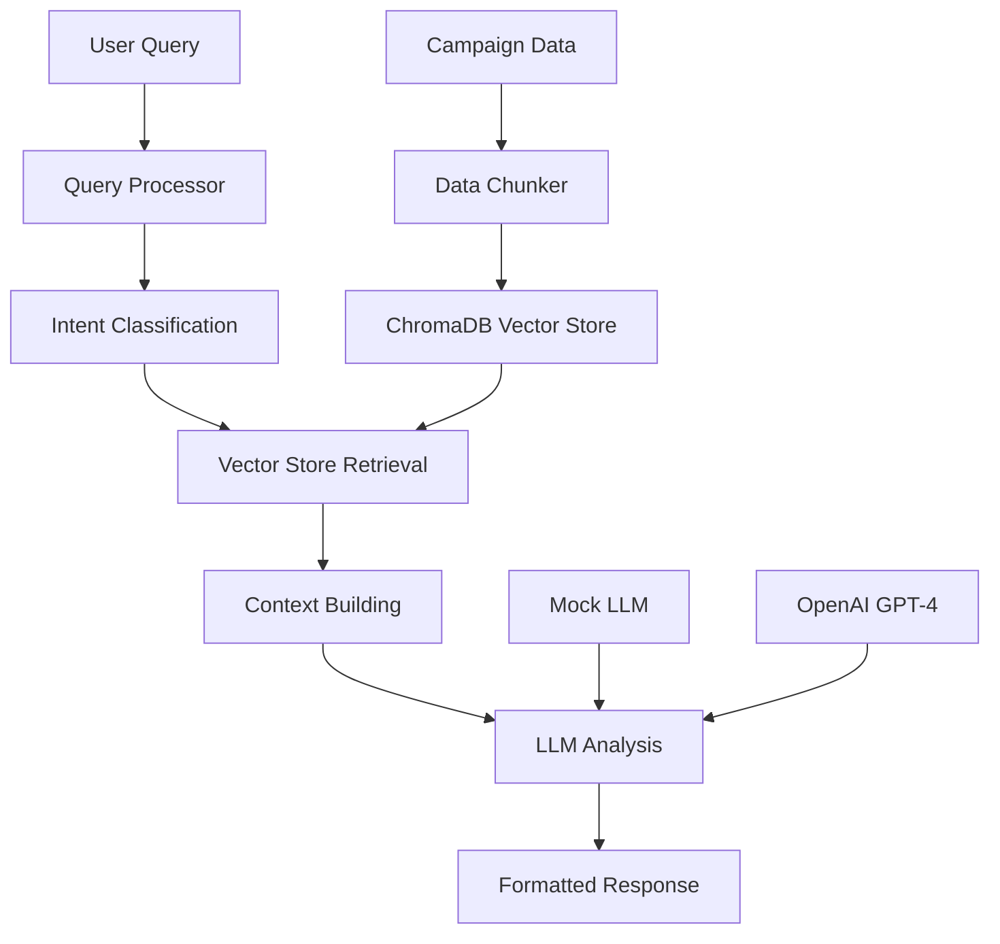

# 🚀 Meta Ads RAG Demo: Conversational Campaign Intelligence

[](https://www.python.org/downloads/)
[](https://streamlit.io/)
[](https://python.langchain.com/)
[](https://www.trychroma.com/)

> **Transform Meta Ads data analysis from manual spreadsheet work to natural language conversations with AI-powered insights.**

Transform how marketing teams interact with campaign data through an intelligent RAG (Retrieval-Augmented Generation) system that provides instant, data-driven insights for Meta advertising performance.


## 🎯 **Problem Solved**

**Before**: Marketing teams spend hours analyzing spreadsheets to answer questions like "Why did my CPM spike?" or "Which audience performs better?"

**After**: Teams ask questions in natural language and get instant, data-backed answers with specific campaign insights and actionable recommendations.

## ✨ **Key Features**

### 🧠 **Intelligent Query Processing**
- **9 Intent Types**: Performance anomalies, campaign comparisons, optimization advice, trend analysis
- **Entity Extraction**: Automatically identifies campaigns, metrics, time periods, and audiences
- **Context-Aware Responses**: Different question types get specialized analysis approaches

### 🔍 **Advanced RAG Pipeline**
- **Semantic Search**: Understands meaning, not just keywords ("cost increase" finds CPM data)
- **Multi-Dimensional Chunking**: Campaign overviews, daily performance, insights, comparisons
- **Source Attribution**: Every insight linked to specific campaign data
- **ChromaDB Integration**: Professional vector database with persistence

### 💬 **Conversational Interface**
- **Chat-Based Analysis**: Ask questions like "Why did my fashion campaign underperform?"
- **Rich Dashboards**: Visual campaign overviews with key metrics
- **Sample Queries**: Pre-built questions to get started quickly
- **Real-Time Responses**: Instant insights with data sources

### 🎛️ **Production-Ready Architecture**
- **Dual Mode Support**: Mock mode (demo) + Production mode (OpenAI API)
- **Modular Design**: 8 specialized components with clear separation of concerns  
- **Error Handling**: Graceful degradation and comprehensive error management
- **Caching**: Streamlit caching for optimal performance

## 🏗️ **System Architecture**



## 🚀 **Quick Start**

### **Demo Mode (No API Keys Required)**
```bash
# Clone the repository
git clone https://github.com/pdeepam/RAGMetaAdsDemo.git
cd RAGMetaAdsDemo

# Install dependencies
pip install -r requirements.txt

# Run the demo
streamlit run app.py
```

### **Production Mode (With OpenAI API)**
```bash
# Set your OpenAI API key
export OPENAI_API_KEY="your-api-key-here"

# Run with full AI capabilities
streamlit run app.py
```

## 💡 **Example Interactions**

### **Performance Analysis**
```
👤 User: "Why did my CPM spike in the fashion campaign?"

🤖 Response: "CPM increased 25% due to audience saturation (frequency hit 3.2x). 
Recommend expanding audience or refreshing creative assets."
```

### **Campaign Comparison**
```
👤 User: "Compare retargeting vs lookalike ROAS"

🤖 Response: "Retargeting: 4.2x ROAS (Electronics) vs 2.1x (Fashion - saturated)
Lookalikes: Consistent 3.4x ROAS with 40% higher reach potential"
```

### **Strategic Recommendations**
```
👤 User: "What optimizations should I prioritize?"

🤖 Response: "1. Fashion: Switch 30% budget to lookalikes
2. Electronics: Scale successful video creative by 50%  
3. Implement frequency capping at 3.0x across campaigns"
```

## 🛠️ **Technical Implementation**

### **Core Components**

| Component | Purpose | Technology |
|-----------|---------|------------|
| **Data Loader** | Campaign data ingestion | Pandas, JSON |
| **Data Chunker** | Intelligent text segmentation | Custom algorithms |
| **Query Processor** | Intent classification & entity extraction | Regex patterns, NLP |
| **Vector Store** | Semantic search & retrieval | ChromaDB, embeddings |
| **RAG Pipeline** | End-to-end orchestration | LangChain framework |
| **LLM Integration** | AI analysis & response generation | OpenAI GPT-4 |
| **Web Interface** | User experience | Streamlit |

### **Data Processing Pipeline**
- **6 Demo Campaigns** → **33 Intelligent Chunks** → **Vector Embeddings**
- **5 Chunk Types**: Overview, Daily Performance, Insights, Comparisons, Global Insights
- **Metadata-Rich**: Campaign ID, dates, industries, audience types, performance metrics

### **Advanced RAG Techniques**
- **Hybrid Retrieval**: Vector similarity + metadata filtering
- **Context Windowing**: Optimal information retrieval per query
- **Query Classification**: 8 intent patterns with confidence scoring
- **Prompt Engineering**: Domain-specific templates for marketing insights

## 📊 **Demo Data Overview**

```
📈 Campaign Portfolio:
├── Holiday Fashion Retargeting (Fashion Industry)
├── Black Friday Electronics Sale 2024 (Electronics)  
├── Lookalike Expansion - Premium Products (Luxury Goods)
├── Fitness January Challenge 2025 (Health & Fitness)
├── Valentine's Day Jewelry Campaign (Jewelry)
└── Spring Home Decor Collection (Home & Garden)

📊 Key Metrics: CPM, CPC, CTR, ROAS, Frequency, Conversions
🎯 Audience Types: Retargeting, Lookalike, Interest-based
📅 Time Periods: Daily performance with seasonal patterns
⚠️ Anomalies: Automated detection of spikes, drops, saturation
```

## 🔧 **Configuration Options**

### **Environment Variables**
```bash
OPENAI_API_KEY=your_openai_api_key          # For production mode
CHROMA_PERSIST_DIRECTORY=./chroma_db        # Vector store location
```

### **Customizable Parameters**
- **Chunk Size**: 1000 tokens (configurable)
- **Chunk Overlap**: 200 tokens 
- **Retrieval Count**: 5 documents per query
- **LLM Temperature**: 0.1 (for consistency)
- **Embedding Model**: text-embedding-3-small

## 🎪 **Live Demo Features**

### **Sample Queries Available**
- "Why did my CPM spike in the fashion campaign?"
- "Compare retargeting vs lookalike ROAS performance"  
- "How is my Black Friday electronics campaign performing?"
- "What's causing audience saturation in retargeting?"
- "What optimizations should I prioritize this week?"

### **Dashboard Views**
- **Campaign Overview**: Portfolio metrics and performance summary
- **Campaign Details**: Deep-dive analysis with charts and insights
- **Chat Interface**: Natural language query and response

## 🏆 **Business Value**

### **Immediate Benefits**
- ⚡ **10x Faster Analysis**: Insights in seconds vs hours of manual work
- 🎯 **Democratized Analytics**: Non-technical users access complex insights  
- 📊 **Data-Driven Decisions**: Every recommendation backed by campaign data
- 🔄 **Consistent Interpretation**: Same data analysis across team members

### **Strategic Impact**
- 💰 **Improved ROAS**: Data-driven optimization recommendations
- ⏰ **Resource Efficiency**: Analysts focus on strategy, not data extraction  
- 📈 **Faster Optimization**: Real-time campaign adjustments
- 🧠 **Knowledge Retention**: Campaign insights preserved and searchable

## 🚦 **System Modes**

| Feature | Demo Mode | Production Mode |
|---------|-----------|-----------------|
| **Vector Search** | Keyword matching | Semantic embeddings |
| **AI Analysis** | Pattern-based responses | GPT-4 powered insights |
| **Setup Required** | None | OpenAI API key |
| **Cost** | Free | $20-100/month typical |
| **Use Case** | Presentations, PoC | Daily operations |

## 📁 **Project Structure**

```
RAGMetaAdsDemo/
├── app.py                          # Streamlit web application
├── requirements.txt                # Python dependencies
├── src/
│   ├── data_loader.py             # Campaign data ingestion
│   ├── data_chunker.py            # Text chunking strategies  
│   ├── query_processor.py         # Intent classification
│   ├── rag_processor.py           # Vector store management
│   └── rag_pipeline.py            # Complete RAG orchestration
├── data/
│   └── campaigns.json             # Demo campaign dataset
├── docs/
│   ├── meta-ads-rag-architecture.md    # Technical architecture
│   └── RAG_System_Explained_For_PMs.md # Business documentation
└── test_integration.py           # End-to-end system validation
```

## 🧪 **Testing & Validation**

```bash
# Run comprehensive integration tests
python test_integration.py

# Expected output: All 6 test components pass
✅ Data loading and chunking working
✅ Query classification working  
✅ RAG processor with ChromaDB integration working
✅ Complete RAG pipeline working
✅ Mock mode functional (no API key required)
```

## 🎯 **Use Cases**

### **Marketing Teams**
- Campaign performance troubleshooting
- Audience comparison analysis
- Budget allocation decisions
- Creative fatigue detection

### **Account Managers**  
- Client reporting automation
- Performance anomaly investigation
- Strategic recommendation generation
- Competitive analysis insights

### **Data Analysts**
- Ad-hoc query resolution
- Pattern discovery in campaign data  
- Automated insight generation
- Stakeholder communication

## 🔮 **Roadmap & Extensions**

### **Phase 1: Production Deployment**
- [ ] Live Meta Ads API integration
- [ ] User authentication & multi-tenancy
- [ ] Database backend (PostgreSQL)
- [ ] Monitoring & observability

### **Phase 2: Enhanced Intelligence**  
- [ ] Predictive analytics & forecasting
- [ ] Automated optimization recommendations
- [ ] Custom dashboard creation
- [ ] Advanced visualization capabilities

### **Phase 3: Platform Expansion**
- [ ] Google Ads integration
- [ ] Cross-platform campaign analysis
- [ ] Team collaboration features
- [ ] Mobile application

## 🤝 **Contributing**

This project demonstrates advanced RAG techniques for marketing analytics. Contributions welcome for:
- Additional query types and intent patterns
- Enhanced data visualization components  
- Integration with other advertising platforms
- Performance optimization improvements

## 📄 **License**

This project is open source and available under the [MIT License](LICENSE).

## 🏷️ **Tags**

`#RAG` `#LangChain` `#ChromaDB` `#MetaAds` `#MarketingAnalytics` `#AI` `#MachineLearning` `#Streamlit` `#VectorDatabase` `#ConversationalAI` `#BusinessIntelligence` `#AdTech`

---

## 💼 **About This Implementation**

This project showcases **production-level RAG engineering** applied to marketing analytics, demonstrating:

- **Advanced AI/ML techniques** beyond basic tutorials
- **Domain expertise integration** with real marketing intelligence  
- **Professional software architecture** with modular, scalable design
- **Business value focus** solving real marketing team pain points

Built with modern AI infrastructure and designed for both demonstration and production deployment.

**Ready to transform your marketing analytics workflow? Try the demo and see conversational campaign intelligence in action.**